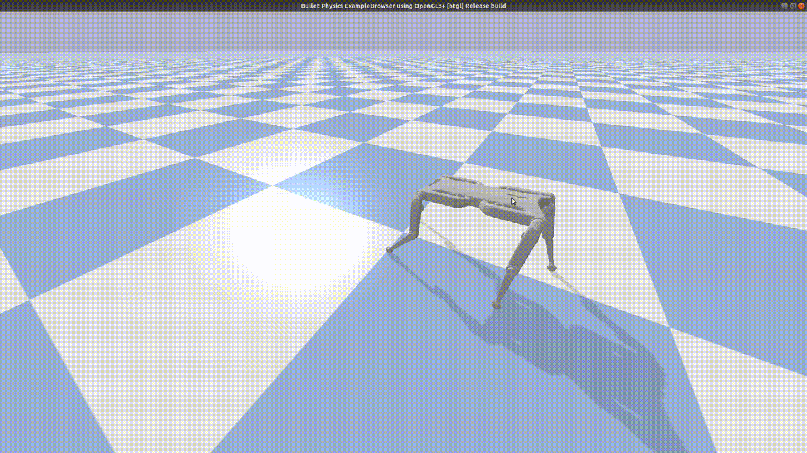

# soloRL
Reinforcement Learning agents and gym-style environment for the [Solo](https://open-dynamic-robot-initiative.github.io/) legged robot.

### Requirements:
- Numpy 
- Gym 
- Pybullet
- PyTorch

### Scripts:
- solo.py: Robot class contains the basic description of the robot. Contains the state and action spaces.
- simulation.py: Scene class to define the contents of the scene and some visual effects. 
- baseEnv.py: Gym-style wrapper for the robot for easier interface with the RL agents. Contains the reward definition.

### Tasks:
- Stand: Balance the robot in a standing posture at above height.
- Walk: The robot should move along a certain direction.
- PointGoal: The robot should navigate towards a specific (x,y) location on the map

Run a toy instance:
```
# Requires Pudb debugger; pip install pudb
$ python main.py --mode gui --config-file ./configs/basic.yaml
```

Configuration files in the config directory are stored in a yaml d format and define the task, robot (solo8 or solo12), scene information, episode length, control method and etc... 

### Reinforcement learning

Three baseline rl agents are implemented for training [PPO](https://arxiv.org/abs/1707.06347), [TD3](https://arxiv.org/pdf/1802.09477.pdf) and [SAC](https://arxiv.org/abs/1812.05905) (sac is still not working quite well).
### Training ###
Train PPO agent
```
$ python -u ./training/train_ppo.py --num-agents 64  --logdir $LOGDIR/ --log-interval 5 --save-interval 50 --lr 0.00025 --entropy-coef 0.01 --clip-param 0.1 --ppo-epoch 5  --mini-batch-size 512 --clip-value-loss --config-file ./configs/basic.yaml --use-gae --use-linear-lr-decay --seed 1
```
Train TD3 agent
```
$ python -u ./training/train_td3.py --num-agents 64  --logdir $LOGDIR/ --log-interval 1000 --save-interval 2000 --config-file ./configs/basic.yaml --seed 1
```

`$LOGDIR` variable contains the directory in which checkpoints of the trained models and tensorboard visulizations are stored

### Testing ### 
Run trained models
```
# test ppo agents
$ python ./testing/test_ppo.py --checkpoint-dir $LOGDIR --mode gui --config-file ./configs/basic.yaml
# test td3 agents
$ python ./testing/test_td3.py --checkpoint-dir $LOGDIR --mode gui --config-file ./configs/basic.yaml
```

### Examples
PPO agents:
| stand | walk | pointGoal |
|-------|------|-----------|
| |  | |

TD3 agents:
| stand | walk | pointGoal |
|-------|------|-----------|
| | | |
